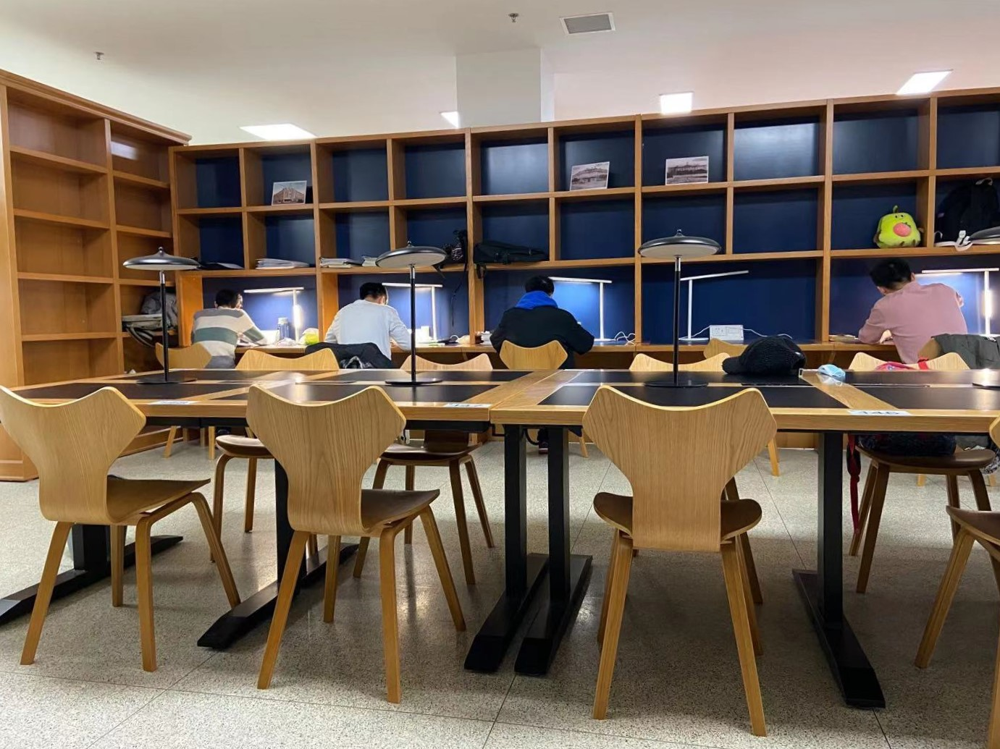

# 大连理工大学图书馆自动预约座位小程序
事情是这样的，在实验室太热，寝室太颓废的条件下，把学习场所转向了图书馆。第一天来图书馆因为没有电源换了两次座位。第一次的座位是这样的。

因为伯川新修好之后就没有来过了，所以看到这些座位的时候还是感觉很哇塞的。特别是这个靠两边的座位，独享小桌，独享台灯，还有电源，比外面的付费自习室好多了。
但是当我打开图书馆座位预约页面找到这两排位置时，情况是这样的

看来大家都很喜欢这两排座位。好，那我早点预约不就可以了，第二天一看，这个系统竟然当天0点就能预约下一天的座位了，而且前一天预约的座位要第二天的八点半之前到图书馆签到。这种需要睡得晚起得早的操作可折腾不动了。
想着应该有网页版的预约入口，就能用selenium搞个自动的了，就有了这个仓库。

---

进入正题。实现上面的需求，需要做两部分工作：自动预约座位和每天0点定时启动这个自动程序。

1. 自动预约座位。这部分主要使用了selenium库，模拟了登录，页面滚动，点击座位，确认预约，登出等操作，都是基本函数吧。使用的话，可以填好自己的学号和密码，路径使用绝对路径，选择好想去的阅览室（我这里是伯川504），然后点击位置要自己试一试了，可以把`click`换成`context_click`看一看点击的位置。
2. 定时启动。我这里代码是在windows上写的，所以直接丢到了实验室24小时开机的电脑上，用windows的任务计划程序实现定时启动。运行Python文件就把`python main.py`写到bat文件里就好。在触发器的程序或脚本选择bat文件，例如`C:/workspace/run.bat`，起始于写`C:/workspace/`，点击运行测试一下是否可以正常工作，之后设置好定时就可以啦。
---
今天0点看了看这个程序，实验室的电脑时间慢了两分钟，不过还是成功预约上了明天的座位，大功告成。剩下的就是早起，八点半前从北山走到伯川了。。。